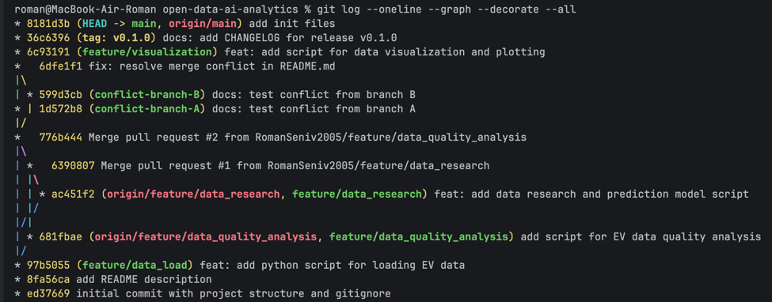

# Звіт з лабораторної роботи
## Тема: Налаштування Git-репозиторію та робота з Git Flow (Data Science Project)

### 1. Мета роботи
Створити базову структуру проєкту для аналізу даних (`open-data-ai-analytics`), налаштувати систему контролю версій Git, відпрацювати створення гілок (feature branches), злиття через Pull Requests, розв'язання merge-конфліктів та тегування релізів.

### 2. Виконані завдання
1. **Ініціалізація:** Створено локальний та віддалений репозиторії. Налаштовано структуру папок (`data`, `notebooks`, `src`, `reports`) та файл `.gitignore` для виключення системних файлів і сирих даних. Заповнено `README.md` з описом проєкту та гіпотезами щодо ринку електромобілів в Україні станом на 2026 рік (джерело даних: data.gov.ua).
2. **Робота з гілками (Git Flow):**
   - Створено гілку `feature/data_load` із базовим скриптом завантаження даних, яку успішно змерджено в `main`.
   - Створено паралельні гілки `feature/data_quality_analysis` та `feature/data_research`. Їх злиття в `main` відбулося через Pull Requests (#1 та #2) на GitHub з додаванням опису "що зроблено".
   - Додано гілку `feature/visualization` з кодом для побудови графіків динаміки реєстрацій.
3. **Вирішення конфліктів:** Штучно створено merge-конфлікт у файлі `README.md` (шляхом одночасної зміни рядків у гілках `conflict-branch-A` та `conflict-branch-B`) та успішно розв'язано його локально.
4. **Реліз:** Додано `CHANGELOG.md` з історією змін проєкту. Фінальний стан проєкту зафіксовано анотованим тегом `v0.1.0`.

### 3. Посилання на репозиторій
[https://github.com/RomanSeniv2005/open-data-ai-analytics](https://github.com/RomanSeniv2005/open-data-ai-analytics)

### 4. Дерево комітів (Git Log)
Нижче наведено граф історії проєкту, що підтверджує виконання всіх етапів роботи з гілками:
