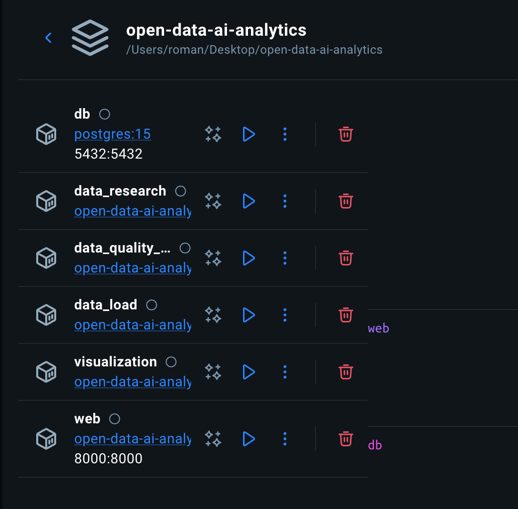
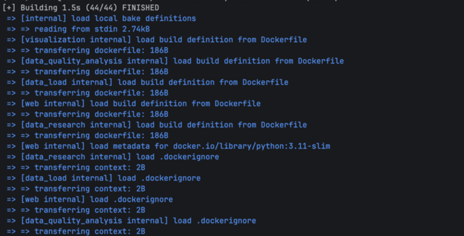
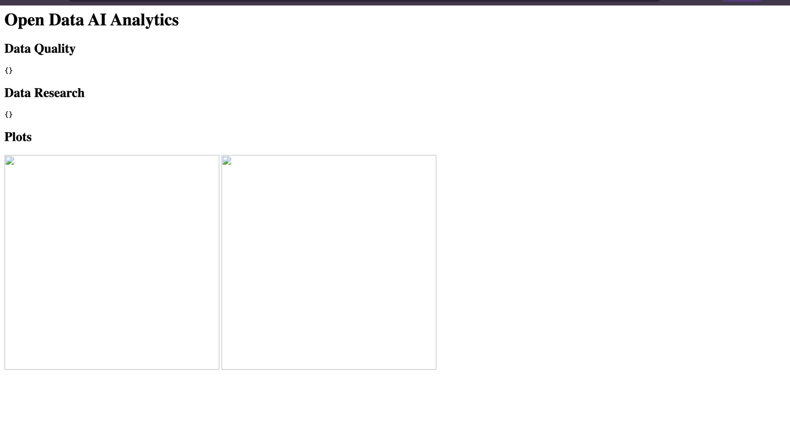

# 📊 Open Data AI Analytics

## 📌 Опис проєкту

Даний проєкт реалізує обробку відкритих даних із використанням мікросервісної архітектури та Docker. Система виконує повний цикл роботи з даними: від завантаження до візуалізації та відображення результатів у веб-інтерфейсі.

---

## 🧱 Структура проєкту

```text
open-data-ai-analytics/
├── data_load/                  # Завантаження CSV у БД
├── data_quality_analysis/      # Аналіз якості даних
├── data_research/             # Статистичний аналіз
├── visualization/             # Побудова графіків
├── web/                       # Веб-інтерфейс
├── data/                      # Вхідні дані (CSV)
├── reports/                   # Звіти
├── plots/                     # Графіки
├── compose.yaml               # Docker Compose
└── README.md
```

---

## ⚙️ Сервіси

### 🔹 db

PostgreSQL база даних, яка зберігає всі дані.

### 🔹 data_load

* читає CSV файл
* створює таблицю в БД
* завантажує дані

### 🔹 data_quality_analysis

* перевіряє пропущені значення
* знаходить дублікати
* перевіряє коректність даних
* формує звіт

### 🔹 data_research

* обчислює статистики
* формує аналітичний звіт

### 🔹 visualization

* будує графіки
* зберігає їх у папку `plots`

### 🔹 web

* відображає результати
* показує звіти та графіки у браузері

---

## 🔌 Порти

| Сервіс          | Порт |
| --------------- | ---- |
| PostgreSQL (db) | 5432 |
| Web             | 8001 |

---

## 🚀 Запуск проєкту

### 1. Перехід у директорію проєкту

```bash
cd open-data-ai-analytics
```

### 2. Запуск Docker Compose

```bash
docker compose up --build
```

### 3. Відкриття веб-інтерфейсу

```text
http://localhost:8001
```

---

## 📦 Результати роботи

Після запуску:

* у папці `reports/` з'являються звіти
* у папці `plots/` з'являються графіки
* у браузері доступний веб-інтерфейс

---

## 📸 Скріншоти

### 🔹 Список контейнерів

**

---

### 🔹 Запуск docker compose

**

---

### 🔹 Веб-інтерфейс

*)*

---

## 🧠 Висновок

У ході виконання лабораторної роботи було створено систему обробки даних із використанням Docker Compose. Було реалізовано взаємодію між сервісами, автоматичне завантаження, аналіз та візуалізацію даних, а також веб-інтерфейс для перегляду результатів. Отримано практичні навички роботи з контейнеризацією та мікросервісною архітектурою.
